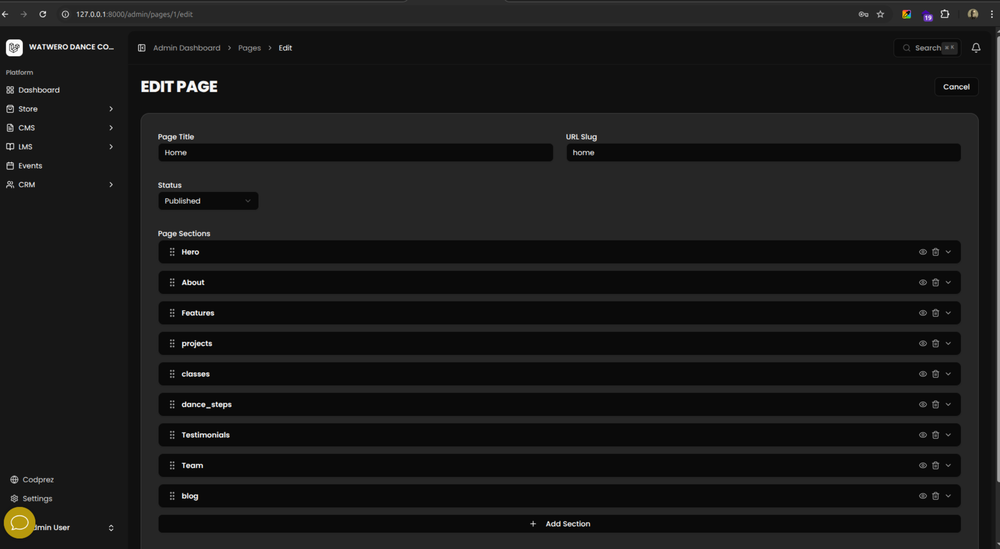

# Laravel Page Builder

[](https://packagist.org/packages/codprez/laravel-page-builder)
[](https://packagist.org/packages/codprez/laravel-page-builder)
[](https://packagist.org/packages/codprez/laravel-page-builder)



A predefined section-based page builder for Laravel + Inertia.js + React. Pages are composed of typed sections with a drag-and-drop editor, Eloquent models, API resources, per-section forms, and a section renderer.

---

## Features

- 12 built-in section types: hero, about, features, stats, team, testimonials, CTA, gallery, FAQ, contact, rich text, and video
- Eloquent `Page` and `PageSection` models with JSON data casting
- API Resources (`PageResource`, `PageSectionResource`) ready for your controllers
- Drag-and-drop React section editor powered by `@dnd-kit`
- Per-section forms with typed fields and image/media support
- `SectionRenderer` React component for frontend rendering
- Custom section registration via `PageBuilder::register()`
- Configurable media model integration
- Tailwind CSS v4 compatible frontend components

---

## Requirements

- PHP ^8.2
- Laravel ^12.0
- Inertia.js v2
- React 19
- `@dnd-kit/core`, `@dnd-kit/sortable`, `@dnd-kit/utilities`
- `lucide-react`
- Tailwind CSS v4

---

## Installation

### 1. Install the package via Composer

```bash
composer require codprez/laravel-page-builder
```

### 2. Publish the config file

```bash
php artisan vendor:publish --tag=page-builder-config
```

### 3. Publish and run the migrations

```bash
php artisan vendor:publish --tag=page-builder-migrations
php artisan migrate
```

### 4. Install frontend dependencies

```bash
npm install @dnd-kit/core @dnd-kit/sortable @dnd-kit/utilities lucide-react
```

### 5. Copy frontend assets

Publish the frontend TypeScript types and React components into your application:

```bash
php artisan vendor:publish --tag=page-builder-resources
```

This copies the following into your `resources/js` directory:

- `types/page-builder.ts` — TypeScript type definitions
- `components/page-builder/` — React editor and renderer components

---

## Configuration

After publishing, `config/page-builder.php` will contain:

```php
return [
    'media_model' => \App\Models\Media::class,
];
```

The configured media model must expose `id`, `url`, and optionally `thumbnail_url` attributes. It is used by image fields in section forms and the `ImageUpload` / `MediaSelector` integration points.

---

## Usage

### Page and Section CRUD

Use the `Page` and `PageSection` models directly via Eloquent:

```php
use Codprez\PageBuilder\Models\Page;
use Codprez\PageBuilder\Models\PageSection;

// Create a page
$page = Page::create([
    'title'            => 'Home',
    'slug'             => 'home',
    'status'           => 'published',
    'is_home'          => true,
]);

// Attach a section
$page->sections()->create([
    'type'       => 'hero',
    'order'      => 1,
    'is_visible' => true,
    'data'       => [
        'title'    => 'Welcome',
        'subtitle' => 'Build pages visually.',
    ],
]);

// Retrieve a page with its sections
$page = Page::with('sections')->where('slug', 'home')->firstOrFail();
```

### Using PageResource in Controllers

```php
use Codprez\PageBuilder\Http\Resources\PageResource;
use Codprez\PageBuilder\Models\Page;

class PageController extends Controller
{
    public function show(string $slug): PageResource
    {
        $page = Page::with(['image', 'sections'])->where('slug', $slug)->firstOrFail();

        return new PageResource($page);
    }

    public function index(): \Illuminate\Http\Resources\Json\AnonymousResourceCollection
    {
        return PageResource::collection(
            Page::with(['image', 'sections'])->orderBy('order')->get()
        );
    }
}
```

### Rendering a Page with Inertia

```php
use Inertia\Inertia;
use Codprez\PageBuilder\Http\Resources\PageResource;
use Codprez\PageBuilder\Models\Page;

class FrontController extends Controller
{
    public function show(string $slug): \Inertia\Response
    {
        $page = Page::with(['image', 'sections' => fn ($q) => $q->where('is_visible', true)->orderBy('order')])
            ->where('slug', $slug)
            ->where('status', 'published')
            ->firstOrFail();

        return Inertia::render('Pages/Show', [
            'page' => new PageResource($page),
        ]);
    }
}
```

### Registering Custom Sections

Use `PageBuilder::register()` in a service provider to add your own section types:

```php
use Codprez\PageBuilder\PageBuilder;

class AppServiceProvider extends ServiceProvider
{
    public function boot(): void
    {
        PageBuilder::register('my_section',
            requiredFields: ['title'],
            imageFields: ['image_id']
        );
    }
}
```

Custom sections will appear in the section picker inside the editor and can be rendered by adding a corresponding case to your `SectionRenderer` usage.

---

## Frontend Setup

### Types

After publishing resources, import types from the copied file:

```ts
import type { Page, PageSection, SectionType } from '@/types/page-builder'
```

### SectionEditor

Use `SectionEditor` in your admin pages to allow drag-and-drop section management:

```tsx
import { SectionEditor } from '@/components/page-builder/section-editor'
import { useForm } from '@inertiajs/react'
import type { PageSection } from '@/types/page-builder'

export default function EditPage({ page }: { page: Page }) {
    const { data, setData, put } = useForm({
        sections: page.sections,
    })

    return (
        <form onSubmit={e => { e.preventDefault(); put(`/pages/${page.id}`) }}>
            <SectionEditor
                sections={data.sections}
                onChange={sections => setData('sections', sections)}
            />
            <button type="submit">Save</button>
        </form>
    )
}
```

The `SectionEditor` component requires `ImageUpload` and `MediaSelector` components to be present in your application at `@/components/image-upload` and `@/components/media-selector`. Implement these to handle image uploads and media library selection according to your application's needs.

### SectionRenderer

Use `SectionRenderer` to render published page sections on the frontend:

```tsx
import { SectionRenderer } from '@/components/page-builder/section-renderer'
import type { Page } from '@/types/page-builder'

export default function ShowPage({ page }: { page: Page }) {
    return (
        <main>
            {page.sections.map(section => (
                <SectionRenderer key={section.id} section={section} />
            ))}
        </main>
    )
}
```

### SectionPicker

To allow users to add new sections, use `SectionPicker` standalone:

```tsx
import { SectionPicker } from '@/components/page-builder/section-picker'

<SectionPicker onSelect={type => addSection(type)} />
```

---

## Section Types

| Type           | Description                                                    |
|----------------|----------------------------------------------------------------|
| `hero`         | Full-width hero with title, subtitle, background image, and CTA |
| `about`        | About block with heading, body text, and optional image        |
| `features`     | Grid of feature cards with icon, title, and description        |
| `stats`        | Row of numeric statistics with labels                          |
| `team`         | Team member grid with name, role, bio, and photo               |
| `testimonials` | Customer/user testimonial carousel or grid                     |
| `cta`          | Call-to-action banner with heading and button                  |
| `gallery`      | Image gallery grid or masonry layout                           |
| `faq`          | Accordion-style frequently asked questions                     |
| `contact`      | Contact form or contact details block                          |
| `rich_text`    | Free-form rich text / HTML content block                       |
| `video`        | Embedded video block (YouTube, Vimeo, or direct URL)           |

---

## Contributing

Contributions are welcome. Please read [CONTRIBUTING.md](CONTRIBUTING.md) before submitting a pull request.

---

## Changelog

See [CHANGELOG.md](CHANGELOG.md) for a history of changes.

---

## License

This package is open-sourced software licensed under the [MIT license](LICENSE).
